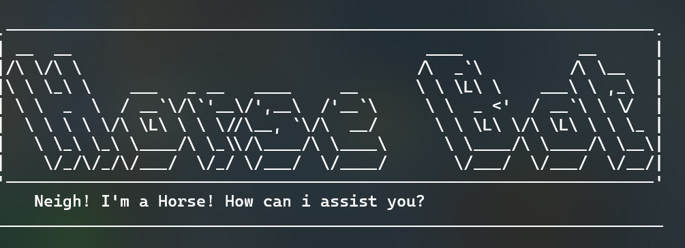

# HorseBot User Guide



HorseBot is a CLI based task manager. Three types of tasks can be created: **Todo, Event and Deadline**. Tasks can then
be marked as **done**, **undone**, or **deleted**. Specific tasks can also be searched for using keywords.

HorseBot supports local data storage, and tasks will be saved and loaded automatically, even after the program is terminated.

## Quick Start
Ensure you have Java 17 or above installed in your Computer.

Download the latest .jar file from [here](https://github.com/tam308/ip/releases/latest).

Copy the file to the folder you want to use as the home folder for HorseBot.

Open a command terminal, cd into the folder you put the jar file in, and use the java -jar HorseBot.jar command to run the application.
A CLI interface similar to the above should appear in a few seconds. 

## Adding Todos

Todo tasks are tasks with no time constraint.

Usage: `todo <description>`

Example: `todo read book`

Expected Output:

```
______________________________________________________________________
    Neigh! added:
    [T][ ] read book
    Now you have 1 task(s) in the list!
______________________________________________________________________
```

## Adding Deadlines

Deadline tasks are tasks with a due date.

Usage: `deadline <description> /by <due date>`

Example: `deadline finish assignment /by 4th Jan`

Expected Output:

```
______________________________________________________________________
    Neigh! added:
    [D][ ] finish assignment(by:4th Jan)
    Now you have 2 task(s) in the list!
______________________________________________________________________
```

## Adding Deadlines

Events are tasks with a start and end time.

Usage: `event <description> /from <start> /to <end>`

Example: `event birthday party /from 9am /to 6pm`

Expected Output:

```
______________________________________________________________________
    Neigh! added:
    [E][ ] birthday party(from:9am to: 6pm)
    Now you have 3 task(s) in the list!
______________________________________________________________________
```

## Listing items

List out all current tasks.

Usage: `list`

Expected Output:

```
______________________________________________________________________
    Neigh! Here are your Tasks!
    1.[T][ ] read book
    2.[D][ ] finish assignment(by:4th Jan)
    3.[E][ ] birthday party(from:9am to: 6pm)
______________________________________________________________________
```

## Marking item as done or undone

Mark an item as completed or uncompleted.

Usage: `mark <task number>` or `unmark <task number>`

Example: `mark 1`

Expected Output:

```
______________________________________________________________________
    Neigh! I've marked this task as done:
    [X] read book
______________________________________________________________________
```

## Deleting a task

Remove a task from the task list.

Usage: `delete <task number>`

Example: `delete 2`

Expected Output:

```
______________________________________________________________________
Neigh! Task removed!:
[D][ ] finish assignment(by:4th Jan)
______________________________________________________________________
```

## Finding tasks

Search for a task via a keyword.

Usage: `find <keyword>`

Example: `find book`

Expected Output:

```
______________________________________________________________________
    Neigh! Here are the matching tasks in your list:
    1.[T][X] read book
______________________________________________________________________
```

## Exiting the program

Terminate the program.

Usage: `bye!`

```
______________________________________________________________________
    Bye bye! It was Neigh-ce to meet you!
______________________________________________________________________
```

